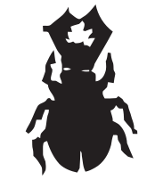

Hive
====

Een groot deel van de evaluatie voor het vak Programmeren 2 wordt toegekend aan een programmeerproject (8 van de 20 punten).
Hoewel iedereen dezelfde opgave krijgt, word je toch verondersteld deze opgave **individueel** op te lossen.
Het delen van code zal bij alle partijen bestraft worden.

We voorzien de volgende planning:
* **woensdag 9 maart**: Het eerste deel van de projectopgave wordt besproken in de oefeningenles.
* **woensdag 23 maart**: Het tweede deel van de projectopgave wordt besproken in de oefeningenles.
* **vrijdag 1 april 23u59**: Uiterste indiendatum van het eerste deel van het project.
* **vrijdag 6 mei 17u00**: Uiterste indiendatum van het tweede deel van het project.
* Inhaalweek: Peer review
* Later kan je eventueel nog uitgenodigd worden voor een mondelinge verdediging.

Je kan aan het project werken tijdens een aantal oefeningensessies, maar dit zal niet voldoende zijn.
Het is met andere woorden de bedoeling **dat je ook buiten de lesuren aan het project werkt**.

**Opgelet!** In het geval van een tweede zittijd kan het project *niet* worden overgedaan.
De punten uit de eerste zittijd worden onveranderd overgenomen naar de tweede zittijd.

## Inleiding
[Hive](https://en.wikipedia.org/wiki/Hive_(game)) is een strategisch bordspel dat met 2 spelers gespeeld wordt.
In dit project zal het de bedoeling zijn om uiteindelijk een werkende versie van dit spel te implementeren met behulp van JavaFX.
In het eerste deel zullen we een *viewer* maken die een spelverloop kan tonen op basis van de notatie zoals gebruikt op [boardspace.net](http://boardspace.net/english/about_hive.html).
In het tweede deel zullen we het effectieve spel implementeren.
Meer details over deel twee volgen op woensdag 23 maart, maar je kan hier alvast rekening mee houden in je ontwerpbeslissingen voor deel 1.

## Het spel
Hive is een strategisch bordspel voor 2 spelers dat net zoals schaken met witte en zwarte pionnen gespeeld wordt. Elke speler start met een aantal zeshoekige pionnen waarop verschillende soorten insecten staan afgebeeld. Het spelbord is initieel leeg en spelers doen om de beurt een zet tot het spel afgelopen is. Het spelbord is een virtueel hexagonaal rooster waardoor de stukken altijd met een volle zijde de andere stukken raken.

### Winnen
Het doel van Hive is om de bijenkoningin van de tegenstander volledig te omringen terwijl je probeert te verhinderen dat hetzelfde gebeurt bij jouw koningin. De winnaar is de eerste speler die daarin slaagt. Merk op dat de koningin volledig moet omringd zijn, maar dat dit niet noodzakelijk met enkel jouw pionnen moet gebeuren.

Een gelijkspel is mogelijk als door het uitvoeren van een beurt de beide koningen tegelijk omringd raken, als het spelbord 3 beurten na elkaar in dezelfde configuratie belandt of als beide spelers het gelijkspel overeenkomen.

### Starten
De witte speler is eerst aan zet en mag elk type pion, behalve de koningin spelen. Vervolgens komt zwart aan zet die een stuk naar keuze, behalve de koningin, op een van de 6 posities naast de eerste pion plaatst. Vervolgens zijn afwisselend wit en zwart aan de beurt. In elke beurt hebben ze de keuze om een nieuw stuk in het spel te brengen of om een eigen stuk op het spelbord te verplaatsen.

De koningin moet in de tweede of derde beurt van die speler geplaatst worden. Zolang de koningin niet geplaatst is, mag een speler geen stukken verplaatsen in zijn beurt en mag hij dus enkel nieuwe stukken in het spel brengen.

Een speler kan passen als en slechts als hij geen geldige zet kan doen. Ook als de enige mogelijk zet diezelfde speler doet verliezen, mag hij dus niet passen.

### Een stuk plaatsen
Een speler kan in zijn beurt een eigen stuk verplaatsen of een nieuw stuk in het spel brengen. Als een nieuw stuk in het spel gebracht wordt, moet de plaatsing van dat stuk aan twee voorwaarden voldoen:

1. Het nieuwe stuk moet raken aan minstens 1 andere eigen pion.
2. Het nieuwe stuk mag niet raken aan pionnen van de tegenstander.

Deze regel is uiteraard niet van toepassing op de eerste zet van beide spelers.

Als er geen plaatsen op het spelbord zijn die aan deze regel voldoen, dan kan een speler dus geen nieuw stuk in het spel brengen. Stukken mogen ook nooit op elkaar geplaatst worden.

Bij onderstaande speltoestand kan de witte speler enkel nieuwe stukken plaatsen op de vakjes die met een W staan aangeduid en zwart op de vakjes waar een B staat. Op de posities met een X kan geen van beide spelers een nieuw stuk plaatsen.

### Een stuk verplaatsen
Als de koningin van een speler al in het spel is, dan kan hij er voor kiezen om in zijn beurt een van zijn stukken te verplaatsen. Elk type insect heeft zijn specifieke manier van bewegen (zie volgende sectie). Ook bij het verplaatsen moeten enkel regels in acht genomen worden:

1. **Enkele zwerm** Alle stukken op het speelbord, de zwerm, moeten op elk moment (zowel voor, tijdens als na de beurt) 1 aaneengesloten geheel vormen. Bij onderstaande speltoestand kan de witte mier niet verplaatst worden omdat de zwarte mier dan een tweede zwerm zou vormen.

    

2. **Bewegingsvrijheid** De stukken (behalve sprinkhanen) kunnen enkel bewegen door te verschuiven. Als een stuk zo omsingeld is waardoor het niet fysiek in (of uit) een positie kan schuiven, dan is dit geen geldige zet. Op onderstaande speltoestand kan de witte mier zich niet naar positie A verplaatsten omdat het gat tussen de witte spin en de zwarte mier niet groot genoeg is.

    

3. **Continu contact** Alle stukken moeten continu in contact blijven met de zwerm. Deze regel lijkt overbodig door regel 1, maar sluit expliciet uit dat in onderstaand voorbeeld de zwarte koningin zich kan verplaatsen naar positie A.

    

Bij het verplaatsen mag je uiteraard wel de stukken van de tegenstander raken.

### De stukken
Het basisspel bestaat uit vijf verschillende types pionnen die elk op hun eigen manier bewegen.

####  De Koningin (Q)

Elke speler start het spel met 1 koningin die in beurt 2 of 3 van die speler moet geplaatst worden. De koningin kan per beurt slechts 1 positie verschuiven. In de spelnotatie wordt de koningin aangeduid met een `Q`(queen).

####  De Mier (A)

In een standaardspel heeft elke speler 3 mieren. Een mier is zeer flexibel en kan in een enkele beurt naar elk ander vakje verplaatst worden dat kan bereikt worden zonder de verplaatsingsregels te overtreden. Dit zullen meestal alle vakjes aan de buitenkant van de zwerm zijn. In onderstaand spelvoorbeeld mag de witte mier zich verplaatsen naar alle grijze vakjes. In de spelnotatie worden mieren aangeduid met een `A` (ant).

####  De Spin (S)

De twee spinnen die elke speler ter beschikking heeft, kunnen zich per
beurt exact 3 (aaneengesloten) vakjes verplaatsen. Hierbij is het niet
toegelaten om een vakje te bezoeken dat de spin tijdens die beurt al bezocht heeft. In onderstaand spelvoorbeeld mag de witte spin zich verplaatsen naar positie A of positie B. In de spelnotatie worden spinnen aangeduid met een `S` (spider).

####  De Kever (B)

Elke speler beschikt over 2 kevers die net als de koningin zich per beurt slechts 1 vakje verplaatsen. In de spelnotatie worden kevers aangeduid met een `B` (beetle).

**Let op**: Wie het spel kent, de regels elders naleest of online een spel speelt, zal merken dat bovenstaande beschrijving van de kever niet overeenstemt met de echte regels. Om het implementeren voor jullie gemakkelijker te maken, laten we dus **niet** toe dat de kever op andere stukken kan klimmen en bewegen.

####  De Sprinkhaan (G)

In tegenstelling tot de andere types pionnen schuift de sprinkhaan niet naar een andere positie, maar springt hij. Springen gebeurt altijd in de richting van 1 van de 6 zijden van de sprinkhaan. De sprinkhaan kan enkel springen in richtingen waar er contact is met een ander stuk. Hij landt vervolgens altijd op de eerste vrije positie die wordt tegengekomen als je een rechte lijn trekt in de springrichting. In onderstaand spelvoorbeeld mag de zwarte tweede sprinkhaan (aangeduid met 2 stippen) zich verplaatsen naar positie A, B, C of D. Elke spel start het spel met 3 sprinkhanen die in de spelnotatie worden aangeduide met een `G` (grasshopper).

## De spelnotatie
Een spel kan beschreven worden door een oplijsting van de uitgevoerde zetten. Elke zet wordt beschreven door 1 regel in een tekstbestand. Elke regel bestaat uit twee groepjes karakters, gescheiden door een spatie. Het eerste groepje karakters duidt het stuk aan dat geplaatst of verplaatst wordt, het tweede groepje karakters de (nieuwe) positie van dat stuk.

### Stukaanduiding
Een stuk wordt aangeduid door 3 karakters:
* een kleine letter `b` of `w` die het kleur van het stuk aangeeft
* een hoofdletter die het type stuk aangeeft (bijvoorbeeld `A` voor mier, `S` voor spin,...)
* een cijfer dat het rangnummer van dat type stuk aangeeft. De rangnummers worden toegekend in volgorde van het plaatsen. **Let op**, de koningin vormt hierop een uitzondering en wordt met `wQ` of `bQ` aangeduid.

Bijvoorbeeld `bG2` is de benaming van de tweede sprinkhaan die door zwart geplaatst werd.

### Positieaanduiding
Positieaanduidingen zijn altijd relatief ten opzichte van een ander stuk op het spelbord. De aanduiding van het andere stuk gebeurt op dezelfde manier als beschreven in de vorige sectie, de positie door middel van een richtingsteken (`\`, `-` of `/`) voor of achter het referentiestuk te plaatsen.

Elk stuk heeft zes mogelijke plaatsen rond zich. Om de 3 plaatsen links van het referentiestuk aan te duiden wordt het richtingsteken vóór de aanduiding van het referentiestuk geplaatst, om de rechtse plaatsen aan te duiden wordt het erna geplaatst. We bekomen dus de volgende mogelijkheden (waarbij `<ref>` de aanduiding van het referentiestuk is):

* `\<ref>`: linksboven
* `-<ref>`: links
* `/<ref>`: linksonder
* `<ref>/`: rechtsboven
* `<ref>-`: rechts
* `<ref>\`: rechtsonder

De positie `\wB1` duidt dus het vakje linksboven de eerstgeplaatste witte kever aan.

Merk op dat een vakje meerdere geldige positieaanduidingen kan hebben. Op de bovenstaande spelsituatie kan het vakje rechts van positie A aangeduid worden met zowel `wS1/` als met `\wG1`.

### Een zet
Als we de notatie van de vorige twee secties combineren en scheiden door een spatie, dan kunnen we een zet beschrijven. Bijvoorbeeld, de zet "plaats de eerste zwarte mier linksboven de tweede witte spin" kan dus beschreven worden als `bA1 \wS2`.

Er wordt in de notatie geen onderscheid gemaakt tussen het in het spel brengen van een nieuw stuk en het verplaatsen van een stuk. Als het beschreven stuk nog niet op het spelbord ligt dan gaan we er van uit dat we het nieuw in het spel brengen, in het andere geval verplaatsen we het.

### Een spel
Het spelverloop van een volledig spel wordt beschreven door een opeenvolging van zetten in het formaat zoals hierboven beschreven. De enige uitzondering hierop is de allereerste zet van het spel, die bevat enkel een stukaanduiding en geen positie.

## Deel 1: Hive viewer
In het eerste deel van het project zullen we een JavaFX GUI bouwen die het spelverloop van een gegeven spel kan visualiseren.
Het spelverloop bevindt zich in een tekstbestand in het hierboven
beschreven formaat. De padnaam van dit bestand wordt meegegeven als opdrachtlijnargument.

De viewer moet minstens de volgende elementen bevatten:
* het speelveld waarop de huidige toestand van het spelbord zichtbaar is
* een lijst van alle zetten uit het gegeven spelverloop waarbij de laatst uitgevoerde zet aangeduid wordt
* een overzicht waarin voor elke speler getoond wordt welke stukken hij nog ter beschikking heeft
* enkele knoppen om zetten uit te voeren en ongedaan te maken
  * `>` Volgende zet uitvoeren
  * `<` Vorige zet ongedaan maken
  * `|<` Terugkeren naar de begintoestand
  * `>|` Alle volgende zetten uitvoeren

Volgende afbeeldingen bevatten voorbeeld hive viewers. Uiteraard is enige artistieke vrijheid toegestaan, maar steek jullie tijd eerst en vooral in functionaliteit. Merk op dat onderstaande afbeeldingen geen geldig spelverloop tonen.

**Opgelet!** Voor het weergeven van de pionnen mogen jullie gebruik
  maken van de afbeeldingen die we jullie geven (zie `afbeeldingen.zip`). Let er echter op dat
  deze op een correcte manier worden ingelezen zodat ze ook werken als
  het programma vanuit een *jar*-bestand wordt
  gestart. Niettegenstaande deze waarschuwing elk jaar in de opgave
  staat, zijn er telkens verschillende studenten die hier de mist in
  gaan, vaak omdat er geen rekening wordt gehouden met het verschil
  tussen hoofd- en kleine letters in bestandsnamen in het
  *jar*-bestand.
  Probeer je programma eens uit op een andere computer om zeker te zijn dat alles werkt.

### Coördinaten
Rekenen in een hexagonaal grid kan op het eerste zicht erg ingewikkeld lijken. Met wat wiskundig inzicht wordt het echter allemaal een stuk eenvoudiger. Om jullie hierbij te helpen, en onmiddellijk ook een eenduidige interface vast te leggen voor bepaalde delen van het programma, leggen we jullie op om **verplicht** met onderstaand scheefgetrokken coördinatenstelsel te werken waarbij we coördinaten gebruiken van de vorm (*r*, *c*). Daarnaast spreken we ook af dat het eerstgeplaatste stuk zich steeds op `(0, 0)`, dus rij 0 en kolom 0 moet bevinden.

### Klikbare tegels
In dit deel van de opgave lijkt het misschien overbodig, maar later kan het handig zijn als jouw tegels "klikbaar" zijn. Dit is geen probleem met een voor-de-hand-liggende oplossing. Er zijn vele oplossingen mogelijk, maar we raden jullie aan om gebruik te maken van een JavaFX [`Group`](http://docs.oracle.com/javafx/2/api/javafx/scene/Group.html) node om een afbeelding te combineren met een zeshoekige [`Polygon`](http://docs.oracle.com/javafx/2/api/javafx/scene/shape/Polygon.html). Door de afbeelding bovenaan te plaatsen is de zeshoek echter niet meer bereikbaar voor klik-events. Dit kan dan weer opgelost worden met [`setMouseTransparent`](http://docs.oracle.com/javafx/2/api/javafx/scene/Node.html#setMouseTransparent(boolean)).

### Testmodus
Om het verbeteren gemakkelijker te maken, vragen we om een automatische testmodus in te bouwen. Hierbij is het de bedoeling dat je programma automatisch alle zetten doorloopt, een afbeelding van de eindtoestand wegschrijft en een lijst van de posities van alle stukken uitschrijft, zonder enige interactie van de gebruiker. Je programma moet in deze modus starten als er, naast het invoerbestand, een tweede opdrachtlijnparameter wordt meegegeven met de padnaam van de te genereren afbeelding.

De testmodus werkt als volgt:
* het programma start zoals normaal
* alle zetten uit het meegegeven bestand worden automatisch uitgevoerd
* het programma schrijft een afbeelding van de eindtoestand weg in png formaat naar de opgegeven locatie
* het programma schrijft een gesorteerde lijst uit van alle stukken met hun positie in de eindtoestand van het spel. Gebruik hiervoor de meegeleverde `TransferPiece` klasse en het door ons opgelegde coördinatensysteem.
* het programma stopt zichzelf

Voor het nemen kan een screenshot van een bepaalde *scene* of *node* kan je de ingebouwde [snapshot](https://docs.oracle.com/javase/8/javafx/api/javafx/scene/Scene.html#snapshot-javafx.scene.image.WritableImage-) functionaliteit van JavaFX gebruiken, in combinatie met de [SwingFXUtils](https://docs.oracle.com/javase/8/javafx/api/javafx/embed/swing/SwingFXUtils.html#fromFXImage-javafx.scene.image.Image-java.awt.image.BufferedImage-) en de [ImageIO](https://docs.oracle.com/javase/8/docs/api/javax/imageio/ImageIO.html#write-java.awt.image.RenderedImage-java.lang.String-java.io.File-).

### TransferPiece
In het bestand `TransferPiece.java` kunnen jullie een rudimentaire voorstelling van een stuk vinden. Deze klasse heeft enkel een constructor om een stuk aan te maken en een `toString` en `compareTo` om het stuk te sorteren en uit te printen zoals nodig voor de testmodus die in de vorige sectie beschreven werd.

Jullie zijn **verplicht** om deze klasse te gebruiken voor het uitschrijven van de eindtoestand, maar het is absoluut niet aangeraden om ze voor iets anders dan dat te gebruiken. Het is niet toegestaan om de `TransferPiece` klasse aan te passen.

### Indienen en specificaties
Het eerste deel moet ten laatste ingediend worden op **vrijdag 1 april om 23u59** via [Indianio](http://indianio.ugent.be).
Hou hierbij rekening met onderstaande opmerkingen:

* Werk verplicht met een packagestructuur.
* Test zelf grondig of de versie die je wil indienen voldoet aan alle opgelegde specificaties.
* Elk bestand dat je indient, moet bovenaan je **naam** en **voornaam** bevatten.
* Gebruik Java 8 en JavaFX.
* Zorg er voor dat de gebruikte bestanden op een correcte manier worden ingeladen zonder bijvoorbeeld veronderstellingen te maken over het gebruikte besturingssysteem (padnamen, hoofdlettergevoeligheid, ...).

Om in te dienen, maak je een zip bestand van de `src`-map van je project.
Deze map kan je terugvinden door in IntelliJ de volgende stappen te volgen:
- Rechtsklik op de naam van het project
- Klik in het menu op "reveal in Finder" of "reveal in Explorer"
- De src-map van het project zou nu zichtbaar moeten zijn

Bij het indienen op Indianio wordt je code automatisch gecompileerd. Het resultaat van de compilatie is zichtbaar voor jullie, dus als de compilatie niet slaagt, dan verwachten we dat je het probleem oplost en opnieuw probeert in te dienen tot alles correct compileert. Wacht dus niet met indienen tot 5 minuten voor de deadline.

Bij het maken van het tweede deel van de opgave is het uiteraard toegelaten om nog wijzigingen aan te brengen aan de klassen die je reeds hebt ingediend. Hou er wel rekening mee dat het eerste deel afzonderlijk zal gequoteerd worden en dat het dus belangrijk is dat alles dan al naar behoren functioneert.

## Beoordeling
We hanteren onder andere onderstaande criteria bij de beoordeling van het project:
* Er zal gecontroleerd worden of het project op **strikt individuele**
  basis gemaakt is; elk gebruik van code van andere studenten zal dan ook bij alle betrokken studenten worden **bestraft**.
* De aangeleerde principes en technieken uit de cursus moeten waar nodig op een correcte manier gebruikt worden in het project.
* De GUI moet verzorgd en overzichtelijk zijn.
* Er worden automatisch punten afgetrokken voor projecten die te laat werden ingediend of niet voldoen aan de vooropgestelde eisen en/of specificaties.
* Het programma mag geen fouten bevatten: het moet foutloos compileren en het mag niet crashen bij de uitvoering.
* De broncode moet leesbaar en overzichtelijk zijn en de toepassing moet een overzichtelijke structuur hebben. Plaats commentaar in de broncode waar nodig, maar overdrijf ook niet. Stukken code die in commentaar staan moeten verwijderd worden uit de broncode !
* Programmeer steeds met efficiëntie in het achterhoofd.
* Programmeer helder en met stijl, gebruik voldoende klassen en methodes (in plaats van knip- en plakwerk), ...
* Indien dit nodig zou blijken, kan je gevraagd worden om je project te komen toelichten.
